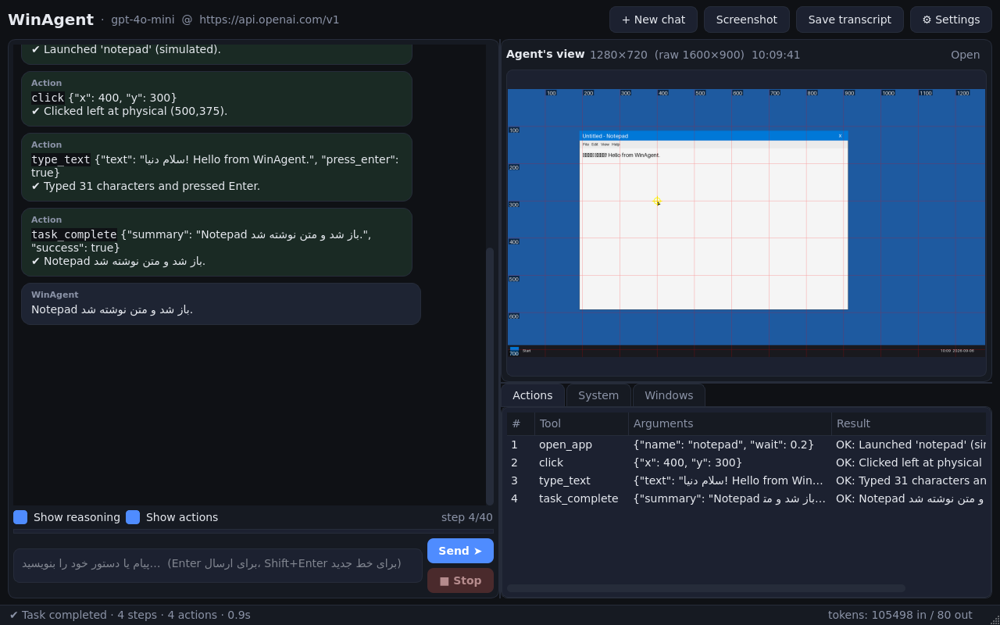
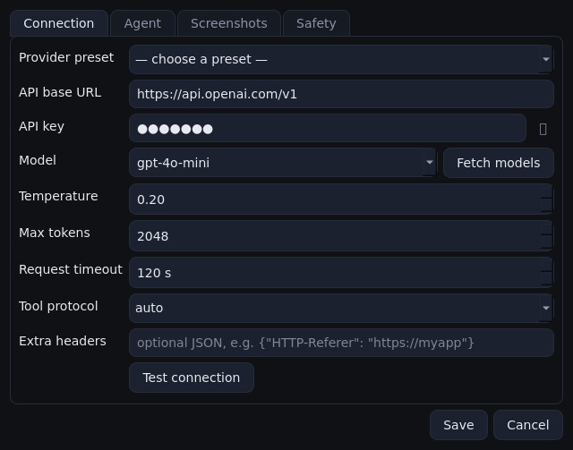

# WinAgent

**WinAgent** یک ایجنت هوش مصنوعی (Computer-Use Agent) برای ویندوز است که به هر مدل زبانی سازگار با API استاندارد OpenAI وصل می‌شود (`api_base_url` + `api_key`) و می‌تواند مثل یک کاربر انسانی با کامپیوتر کار کند: برنامه‌ها را باز کند، ماوس و کیبورد را کنترل کند، صفحه‌نمایش را ببیند و تحلیل کند، پنجره‌ها را مدیریت کند، دستورات PowerShell اجرا کند و … . رابط گرافیکی آن یک پنجرهٔ چت است که همراه با «دید ایجنت» (اسکرین‌شات لحظه‌ای) و لاگ اقدامات نمایش داده می‌شود.

**WinAgent** is an LLM-powered computer-use agent for Windows with a chat GUI. It connects to any OpenAI-compatible endpoint (OpenAI, OpenRouter, Groq, DeepSeek, Gemini's OpenAI-compat endpoint, Ollama, LM Studio, vLLM, …), sees the screen through screenshots and acts with the mouse, keyboard, shell and window manager — everything a human can do on a Windows desktop.



---

## ویژگی‌ها / Features

| | |
|---|---|
| 🔌 **اتصال به هر مدل زبانی** | فقط `api_base_url`، `api_key` و نام مدل را وارد کنید. با OpenAI، OpenRouter، Groq، DeepSeek، Gemini، Ollama، LM Studio، vLLM و هر سرور سازگار با OpenAI کار می‌کند. |
| 📡 **پروتکل JSON استاندارد** | ارتباط ایجنت و مدل با ابزارهای JSON-Schema انجام می‌شود: پروتکل *native* (OpenAI `tools` / `tool_calls`) و در صورت پشتیبانی‌نشدن، پروتکل *JSON-in-text* به‌صورت خودکار. |
| 👁 **دیدن و تحلیل صفحه** | اسکرین‌شات با شبکهٔ مختصات و نشانگر ماوس برای مدل ارسال می‌شود؛ بزرگ‌نمایی ناحیه‌ای، چند مانیتور و DPI-awareness پشتیبانی می‌شود. مدل‌های بدون قابلیت بینایی هم با اطلاعات متنی پنجره‌ها کار می‌کنند. |
| 🖱 **کنترل کامل ماوس و کیبورد** | کلیک/دابل‌کلیک/راست‌کلیک، درگ، اسکرول، تایپ یونیکد (فارسی، ایموجی…)، کلیدهای ترکیبی (`ctrl+shift+esc`, `win+r`, …) از طریق `SendInput` ویندوز. |
| 📋 **ناوبری منو فقط با کیبورد** | ابزار `menu` منوی نوار منو و زیرمنوها را بدون ماوس باز و انتخاب می‌کند (Alt+کلید مخفف، type-ahead و کلیدهای جهتی: `Right` برای باز شدن زیرمنو و `Enter` برای انتخاب) — چون حرکت نشانگر روی منوی باز، زیرمنوها را می‌بندد. |
| 🌐 **بررسی زبان سیستم قبل از هر کاری** | پیش از شروع هر درخواست، زبان ورودی (چیدمان کیبورد) ویندوز بررسی و در صورت خطا به چیدمان مطلوب (پیش‌فرض `en-US`) برمی‌گردد تا شورت‌کات‌ها و منوها درست کار کنند؛ قبل از هر کلیدشکنی هم دوباره چک می‌شود. |
| ⚡ **اسکرین‌شات سریع‌تر و کوچک‌تر** | اسکرین‌شات‌های تکراری (صفحهٔ بدون تغییر) دوباره به مدل ارسال نمی‌شوند؛ فرمت `auto` برای صفحه‌های تخت UI از PNG بدون‌ازدست‌رفتگی و برای محتوای عکس/سه‌بعدی از JPEG استفاده می‌کند تا بدون افت کیفیت، حجم تصویر کمینه شود. |
| 🔁 **ریزیدن در حلقهٔ اقدام بی‌اثر** | اگر یک اقدام (مثلاً کلیک روی یک کمبوباکس غیرفعال) چند بار بدون هیچ تغییری تکرار شود، ایجنت هشدار می‌گیرد و یا روش را عوض می‌کند (منو، شورت‌کات، دستور) یا آن مرحله را رها کرده به ادامهٔ کار می‌رسد. |
| 🧊 **کار با نماهای سه‌بعدی** | برای نرم‌افزارهایی مثل Blender، ایجنت قبل از کار با اشیاء پنهان‌شدهٔ پشت اشیاء دیگر، زاویهٔ دوربین را با درگ دکمهٔ میانی (orbit) عوض می‌کند یا شیء را از Outliner/نام انتخاب می‌کند. |
| 🪟 **مدیریت برنامه‌ها و پنجره‌ها** | اجرای برنامه با نام (Notepad, Chrome, Excel, Settings…)، مسیر، منوی استارت یا اپ‌های UWP؛ فوکوس/کوچک/بزرگ/بستن/جابه‌جایی پنجره‌ها؛ فهرست کنترل‌های Win32. |
| 💻 **PowerShell / cmd، فایل و کلیپ‌بورد** | اجرای دستورات با خروجی کامل، خواندن/نوشتن فایل، فهرست پوشه، خواندن/نوشتن کلیپ‌بورد. |
| 🛡 **ایمنی** | تأیید کاربر پیش از دستورات مخرب و بازنویسی فایل، غیرفعال‌کردن shell/نوشتن فایل، سقف تعداد گام، کلید توقف اضطراری سراسری (`Ctrl+Alt+Esc`) و fail-safe گوشهٔ صفحه. |
| 💬 **رابط گرافیکی چت** | پنجرهٔ چت با پشتیبانی راست‌به‌چپ، نمایش استدلال و اقدامات مدل، دید زندهٔ ایجنت، لاگ اقدامات، اطلاعات سیستم و پنجره‌ها، دیالوگ تنظیمات با تست اتصال و دریافت فهرست مدل‌ها. |
| 📌 **پنل وضعیت گوشهٔ صفحه** | هنگام کار ایجنت، یک پنل کوچک همیشه‌رو نشان می‌دهد الان چه کاری در حال انجام است (گام، ابزار، نتیجه، زمان) با دکمهٔ Stop؛ پنجره‌های خود برنامه به‌صورت خودکار از اسکرین‌شات‌ها و از زیر کلیک‌های ایجنت کنار می‌روند. |
| 🧪 **قابل تست بدون ویندوز** | یک بک‌اند شبیه‌سازی‌شده (`--demo`) امکان اجرای GUI و تست کامل حلقهٔ ایجنت را روی هر سیستم‌عاملی می‌دهد؛ تست‌های خودکار همراه با یک سرور OpenAI ساختگی. |

---

## نصب و اجرا / Installation

پیش‌نیاز: **Windows 10/11** و **Python 3.10+** ([python.org](https://www.python.org/downloads/) – گزینهٔ *Add python.exe to PATH* را فعال کنید).

```bat
git clone https://github.com/alihashemzadeh201-blip/WinAgent.git
cd WinAgent
run.bat
```

`run.bat` در اولین اجرا یک محیط مجازی می‌سازد، وابستگی‌ها را نصب می‌کند، `config.json` را از روی `config.example.json` می‌سازد و رابط گرافیکی را باز می‌کند. سپس از دکمهٔ **⚙ Settings** آدرس API، کلید و نام مدل را وارد کنید و با **Test connection** اتصال را بررسی کنید.

نصب دستی:

```bat
python -m venv .venv
.venv\Scripts\activate
pip install -r requirements.txt
python -m winagent
```

### پیکربندی / Configuration

تنظیمات در `config.json` (کنار برنامه یا در `%APPDATA%\WinAgent\config.json`) ذخیره می‌شوند و از داخل GUI قابل ویرایش‌اند. متغیرهای محیطی بر فایل اولویت دارند:

```powershell
$env:WINAGENT_API_BASE_URL = "https://api.openai.com/v1"
$env:WINAGENT_API_KEY      = "sk-..."
$env:WINAGENT_MODEL        = "gpt-4o-mini"
python -m winagent
```

مهم‌ترین گزینه‌ها:

| کلید | توضیح |
|---|---|
| `api_base_url` | آدرس پایهٔ API سازگار با OpenAI (مثلاً `https://api.openai.com/v1`, `https://openrouter.ai/api/v1`, `http://localhost:11434/v1`) |
| `api_key` | کلید API (برای سرورهای محلی می‌تواند خالی باشد) |
| `model` | نام مدل. برای بهترین نتیجه از یک مدل **دارای بینایی (vision)** استفاده کنید: `gpt-4o`, `gpt-4o-mini`, `claude-3.5-sonnet` (از طریق OpenRouter), `gemini-2.0-flash`, `qwen2.5-vl`, `llama3.2-vision`… |
| `tool_protocol` | `auto` (پیش‌فرض)، `native` (OpenAI tools) یا `json` (پاسخ JSON در متن؛ برای مدل‌های بدون function calling) |
| `vision_enabled` | ارسال اسکرین‌شات به مدل (در صورت عدم پشتیبانی مدل، خودکار خاموش می‌شود) |
| `max_steps` | حداکثر تعداد گام (فراخوانی ابزار) برای هر درخواست |
| `max_response_retries` | تعداد درخواست‌های اصلاح پاسخ خراب مدل (پیش‌فرض ۳ تلاش مجدد، مستقل از `max_retries` شبکه؛ بین ۰ و ۱۰). |
| `confirm_dangerous_actions` | پرسیدن از کاربر قبل از دستورات مخرب (حذف، فرمت، خاموش‌کردن، …) و بازنویسی فایل |
| `allow_shell_commands`, `allow_file_write` | خاموش‌کردن کامل این قابلیت‌ها |
| `stop_hotkey`, `mouse_failsafe` | کلید توقف اضطراری سراسری و توقف با بردن ماوس به گوشهٔ بالا-چپ |
| `coordinate_space` | واحد مختصات مدل: `image_pixels` (پیش‌فرض) یا `normalized_1000` (انتخاب صریح؛ روی هر دو محور). از نام مدل یا مقدار x/y حدس زده نمی‌شود. |
| `screenshot_native_resolution` | ارسال با ابعاد اصلی و بدون کوچک‌سازی در برنامه (پیش‌فرض خاموش؛ مناسب عیب‌یابی مختصات، با احتمال هزینهٔ بیشتر تصویر/توکن). |
| `screenshot_max_width`, `screenshot_grid`, … | کیفیت و حاشیه‌نویسی اسکرین‌شات‌ها (برای کاهش هزینهٔ توکن) |
| `screenshot_format` | فرمت تصویر: `auto` (پیش‌فرض؛ PNG بدون‌ازدست‌رفتگی برای صفحه‌های تخت و JPEG برای عکس/سه‌بعدی)، `jpeg` یا `png` |
| `screenshot_jpeg_quality`, `screenshot_jpeg_subsampling` | کیفیت JPEG (۳۰–۱۰۰) و زیرنمونه‌گیری کروما (۰=بهترین)؛ کیفیت هرگز به‌صورت خودکار افت نمی‌کند |
| `dedupe_screenshots` | ارسال‌نکردن اسکرین‌شات تکراری وقتی صفحه بی‌تغییر است (پیش‌فرض روشن) |
| `preferred_keyboard_layout`, `auto_fix_keyboard_layout` | زبان/چیدمان کیبورد مطلوب (پیش‌فرض `en-US`) که ایجنت پیش از هر کار و هر کلیدشکنی بررسی و در صورت نیاز اصلاح می‌کند |
| `backend` | `auto` یا `windows` برای دسکتاپ واقعی ویندوز؛ `fake` فقط برای دموی صریح با تصاویر و اقدامات شبیه‌سازی‌شده است. خطای بک‌اند واقعی هرگز به حالت ساختگی تبدیل نمی‌شود. |
| `response_language` | زبان پاسخ (`auto` = زبان کاربر) |
| `extra_system_prompt` | دستورالعمل‌های اضافی برای ایجنت |
| `gui_mode_while_running` | رفتار پنجرهٔ برنامه هنگام کار ایجنت: `overlay` (پیش‌فرض)، `visible`، `minimize` یا `none` – توضیح در بخش [«پنجرهٔ برنامه هنگام کار ایجنت»](#پنجرهٔ-برنامه-هنگام-کار-ایجنت--the-gui-while-the-agent-works) |
| `overlay_corner`, `overlay_exclude_from_capture` | گوشهٔ نمایش پنل وضعیت و خارج‌کردن آن از اسکرین‌شات‌ها توسط ویندوز |

### حالت‌های اجرا

```bat
python -m winagent                      :: رابط گرافیکی
python -m winagent --cli                :: چت در ترمینال
python -m winagent --task "Notepad را باز کن و سلام دنیا بنویس"   :: اجرای یک وظیفه و خروج
python -m winagent --demo               :: GUI با دسکتاپ شبیه‌سازی‌شده (بدون تأثیر روی سیستم)
python -m winagent --init-config        :: ساخت config.json پیش‌فرض
```

### عیب‌یابی: به‌جای اسکرین‌شات یک صفحهٔ آبی می‌بینم

اگر بالای «Agent's view» عبارت **DEMO / fake** دیده می‌شود، تصویر آبی متعلق به دسکتاپ شبیه‌سازی‌شده است؛ این تصویر، صفحهٔ واقعی شما نیست. برای دریافت اسکرین‌شات واقعی:

1. برنامه را روی **خود ویندوز، با Python ویندوز** اجرا کنید؛ نه داخل WSL، Docker یا سرور لینوکس. نمایش GUI روی یک سیستم دیگر به معنی دسترسی به صفحهٔ آن سیستم نیست.
2. در **Settings → Safety → Desktop backend** گزینهٔ **windows** یا **auto** را انتخاب و Save کنید. حتی اگر برنامه با `--demo` شروع شده باشد، تغییر صریح بک‌اند در تنظیمات اکنون اعمال می‌شود و تصویر و سابقهٔ داخلی دسکتاپ قبلی پاک می‌شود.
3. برای اطمینان از انتخاب بک‌اند واقعی، از پوشهٔ پروژه اجرا کنید:

   ```bat
   .venv\Scripts\python.exe -m winagent --backend windows
   ```

   برای اجرای عادی `--demo` را حذف کنید و مقدار `backend` در فایل تنظیمات و متغیر محیطی `WINAGENT_BACKEND` را بررسی کنید؛ `--backend windows` بر آن‌ها اولویت دارد. ذخیرهٔ تنظیمات دیگر در یک اجرای موقت `--demo`، به‌تنهایی حالت `fake` را دائمی نمی‌کند.
4. دکمهٔ **Screenshot** را بزنید؛ این تست به API key یا مدل بینایی نیاز ندارد. منبع تصویر باید **windows · real desktop** باشد.

اگر بک‌اند واقعی راه‌اندازی نشود، برنامه خطای اصلی را نشان می‌دهد و ارسال دستور/اسکرین‌شات را غیرفعال می‌کند؛ **دیگر به `fake` برنمی‌گردد**. پس از رفع خطا، دوباره تنظیمات را Save کنید تا راه‌اندازی تکرار شود. روی سیستم‌عامل‌های دیگر، `auto` خطای روشن می‌دهد؛ دمو فقط با `--demo` یا انتخاب صریح `fake` اجرا می‌شود و تصاویرش برچسب DEMO دارند.

اگر منبع تصویر **windows** است ولی اسکرین‌شات همچنان خالی است، دسکتاپ باید باز و session ویندوز فعال باشد؛ در اتصال Remote Desktop، session قطع‌شده را دوباره وصل کنید. جزئیات خطا در `%APPDATA%\WinAgent\logs\winagent.log` ثبت می‌شود. مسیر تصویربرداری ویندوز پنجره‌های layered را نیز با `include_layered_windows=True` می‌گیرد؛ با این حال صفحهٔ قفل، دسکتاپ امن UAC و محتوای محافظت‌شده ممکن است قابل تصویربرداری نباشند.

### پاسخ ناقص مدل و تکرار خودکار

پاسخ خالی، JSON ناقص، آرگومان خراب ابزار، پاسخ بریده‌شده با `finish_reason=length` و تکرار صرفِ توضیحات اسکرین‌شات (مثل `document, y from 0 (top) to 719 (bottom).]`) دیگر جواب نهایی محسوب نمی‌شوند. برنامه همان وظیفه، تصویر و نتایج قبلی را همراه با درخواست **یک پاسخ کامل و اصلاح‌شده** دوباره به مدل می‌فرستد.

- پیش‌فرض: یک درخواست اولیه + حداکثر **۳ درخواست اصلاح**. از **Settings → Agent → Malformed-response retries** یا `max_response_retries` قابل تغییر است؛ ۰ یعنی بدون تلاش مجدد.
- هیچ ابزاری از پاسخ ردشده اجرا نمی‌شود؛ حتی اگر ابتدای یک دستهٔ ابزار سالم و ادامهٔ آن خراب باشد. اقدامات موفقِ دورهای قبل هم دوباره اجرا نمی‌شوند.
- بعد از تمام‌شدن تلاش‌ها، خطای روشن نمایش داده می‌شود، نه متن ناقص به‌عنوان موفقیت. **Stop** در مرحلهٔ اصلاح هم فعال است. خطای احراز هویت، فیلتر محتوا و امتناع صریح مدل، خطای قالب‌بندی محسوب نمی‌شوند.
- پاسخ چت بدون ابزار در **هر دو حالت `native` و `json`** باید از مدل به‌صورت `{"message":"پاسخ کامل"}` برسد؛ برنامه فقط متن داخل آن را به کاربر نشان می‌دهد. متن آزاد—حتی مثل `b sideways.` که JSON ناقص یا توضیح اسکرین‌شات هم نیست—دیگر پایان معتبر محسوب نمی‌شود. این تغییر در قرارداد مدل است؛ **کاربر همچنان عادی چت می‌کند و لازم نیست JSON بنویسد**.
- از زمانی که در همان درخواست ابزاری فراخوانی شده، حتی `{"message":"Done"}` هم کار را تمام نمی‌کند. مدل باید ابزار بعدی را اجرا کند، با `ask_user` سؤال بپرسد یا صریحاً `task_complete` با خلاصهٔ غیرخالی و `success=true/false` بفرستد. عدم امکان انجام کار/امتناع باید صادقانه با `success=false` گزارش شود؛ سیگنال صریح امتناع یا فیلتر ارائه‌دهنده همچنان بدون تلاش مجدد پذیرفته/متوقف می‌شود.
- بازیابی مبتنی بر فهرست عبارت‌های خراب یا حداقل طول متن نیست: پاسخ کوتاه معتبر مثل `{"message":"بله"}` برای چت پذیرفته می‌شود. پاسخ نامعتبر وارد تاریخچهٔ دائمی نمی‌شود؛ درخواست اصلاح می‌گوید خروجی را از روی هدف اصلی بازسازی کند، نه اینکه صرفاً تکهٔ خراب را داخل JSON بگذارد. جواب‌های چتِ تأییدشده نیز با قالب کامل در تاریخچه نگه داشته می‌شوند.
- سقف تلاش مجدد همان `max_response_retries` است و Stop فعال می‌ماند. در صورت تکرار خطا، پایان از نوع **error** است، نه موفقیت یا نمایش تکهٔ ناقص به‌عنوان جواب نهایی. این محافظ، قالب و علامت پایان را بررسی می‌کند؛ صحت معنایی هر جمله داخل یک پاسخ ساختاریِ کامل همچنان وابسته به مدل است. اگر پاسخ‌ها مرتب بریده می‌شوند، مقدار **Max tokens** و گزارش `finish_reason` را بررسی کنید.

### ادامهٔ گفتگو و درخواست بعدی

پس از تمام‌شدن یک کار، می‌توانید در همان چت ادامه بدهید؛ مثلاً «حالا به همان فایل یک خط دیگر اضافه کن». هر درخواست مرز مستقلی دارد و `task_complete` فقط همان درخواست را تمام می‌کند، نه کل گفتگو.

- برای درخواست بعدی، متن درخواست‌های قبلی، نتیجهٔ واقعی هرکدام و اطلاعات مفیدِ ابزارها مثل مسیر فایل و پاسخ کاربر نگه داشته می‌شود؛ فرمان‌های اجرایی، `task_complete` و تصاویر قدیمی دوباره به‌عنوان سابقهٔ فعال فرستاده نمی‌شوند. این جمع‌بندی از نتایج ثبت‌شده ساخته می‌شود و یک تماس اضافه با مدل ندارد. خروجی‌های طولانی ابزارها با علامت صریح کوتاه می‌شوند و در صورت نیاز باید منبع دوباره خوانده شود.
- اسکرین‌شات شروع درخواست جدید، مرجع همان درخواست است. اگر گرفتن آن شکست بخورد، تصویر/فریم کار قبلی بی‌صدا جای آن استفاده نمی‌شود. حالت مختصات و تبدیل آن تغییری نمی‌کند و بررسی اضافی پس از هر حرکت ماوس هم برنمی‌گردد.
- در گفتگوهای طولانی، **درخواست جاری حذف نمی‌شود**. کوتاه‌سازی، جفت‌های کاملِ قدیمیِ درخواست/پاسخ و سپس دورهای کامل ابزار را کنار می‌گذارد، نه نصف یک فراخوانی و نتیجهٔ آن. کار انجام‌شده در یک یادداشت پیشرفت حفظ می‌شود تا دوباره اجرا نشود. آخرین دور ابزار و دورهای حامل تصاویرِ باقی‌مانده حفظ می‌شوند؛ بنابراین `max_history_messages` سقف نرم است و یک دستهٔ بزرگِ ابزار ممکن است موقتاً از آن بیشتر شود. تعداد تصاویر همچنان با `max_images_in_context` محدود می‌شود.
- وضعیت خطا، توقف یا انتظار برای پاسخ کاربر، به‌عنوان موفقیت ذخیره نمی‌شود. ذخیرهٔ تنظیمات روی همان دسکتاپ نیز این سابقهٔ خلاصه را حفظ می‌کند؛ **New chat** یا عوض‌کردن بک‌اند، آن را پاک می‌کند.
- بودجهٔ اصلاح پاسخ خراب همان ۳ تلاش مجدد پیش‌فرض است؛ درخواست اصلاح روی **کار جاری** متمرکز می‌ماند. این اصلاح، ساختار و مرزبندی سابقه را درست می‌کند و تضمین صحت معنایی همهٔ پاسخ‌های هر مدل نیست.

### دقت مختصات کلیک

در حالت پیش‌فرض `image_pixels`، تبدیل مختصات از **اندازهٔ واقعی تصویر ارسال‌شده** برای X و Y جداگانه انجام می‌شود تا گردشدن ارتفاع هنگام کوچک‌سازی باعث خطای عمودی نشود. در ویندوز، وضعیت DPI قبل از ساخت پنجرهٔ Qt تنظیم می‌شود، تصویربرداری/هندسه در فضای پیکسل فیزیکی انجام می‌شود و ماوس از `SetPhysicalCursorPos` / `GetPhysicalCursorPos` استفاده می‌کند. افست ثابت و حدسی برای جبران کلیک اضافه نشده است.

پس از به‌روزرسانی، برنامه را کاملاً ببندید و دوباره اجرا کنید. مختصات ابزارها مربوط به آخرین **اسکرین‌شات کامل** است، نه پیش‌نمایش کوچک GUI، مختصات منطقی ویندوز یا تصویر برش‌خورده؛ مدل نباید دوباره ضریب DPI یا ارتفاع نوار عنوان/وظیفه را اعمال کند. بعد از دیدن ناحیهٔ zoom، قبل از کلیک یک تصویر کامل بگیرید. مختصات خارج از تصویر خطا می‌دهند و دیگر به لبهٔ تصویر جابه‌جا نمی‌شوند.

در اجرای عادی، موقعیت نشانگر پس از هر حرکت یا درست پیش از کلیک دوباره خوانده و با هدف مقایسه نمی‌شود؛ موفقیت APIهای ورودی ویندوز مبناست. `mouse_move` نیز اسکرین‌شات خودکار و تأخیرِ انتظار برای آن ندارد. برای کلیک، مدل باید مستقیماً `click` با x/y را فراخوانی کند، نه یک دور «حرکت، بررسی موقعیت، کلیک». اگر hover منو یا tooltip تازه‌ای باز کند، مدل می‌تواند صریحاً `screenshot` بگیرد. اسکرین‌شات خودکارِ کلیک، تایپ، اسکرول و drag همچنان مطابق تنظیمات باقی است.

تبدیل مختصات، بررسی مرز تصویر و تغییر هندسهٔ نمایشگر، خطاهای API ویندوز و توقف اضطراری حذف نشده‌اند. موقعیت ماوس برای شروع حرکت نرم، توقف گوشهٔ صفحه یا نمایش نشانگر در یک اسکرین‌شاتِ درخواستی همچنان خوانده می‌شود؛ این‌ها صحت‌سنجیِ رسیدن به هدف نیستند. در لاگ سطح `INFO`، سطرهای `Captured frame` و `Pointer mapping` ابعاد تصویر، شناسهٔ فریم، نقطهٔ مدل و هدف فیزیکیِ محاسبه‌شده را نشان می‌دهند، نه تأیید موقعیت واقعی بعد از عمل. برای عیب‌یابیِ درخواستی می‌توان از `get_screen_info` (موقعیت فیزیکی در `mouse_physical`) یا اسکرین‌شات استفاده کرد. انتخاب اشتباه نقطه توسط مدل یا جابه‌جایی/محدودشدن نشانگر توسط برنامه‌های دیگر همچنان ممکن است؛ در صورت مشاهدهٔ خطا، نتیجهٔ عمل را روی تصویر تازه بررسی کنید.


#### تغییر رزولوشن و آزمایش بدون کوچک‌سازی

WinAgent در حالت عادی **رزولوشن ویندوز را تغییر نمی‌دهد**؛ فقط برای کاهش هزینه، تصویر ارسالی را به `screenshot_max_width` کوچک می‌کند. این با تغییر واقعی رزولوشن، جابه‌جایی مانیتورها یا تغییر session ریموت متفاوت است.

- همهٔ مختصات یک پاسخ مدل اکنون به **آخرین تصویر کاملی که قبل از همان پاسخ به مدل داده شده** متصل می‌مانند. اسکرین‌شات خودکار یا crop بین ابزارهای آن پاسخ، مبنای کلیک‌های بعدی همان پاسخ را عوض نمی‌کند. اسکرین‌شات خودکار نیز محدودهٔ «همهٔ مانیتورها» را حفظ می‌کند.
- ابعاد/مبدأ نمایشگر قبل از ارسال ورودی ماوس با فریم مرجع مقایسه می‌شود. اگر تغییر کرده باشد، آن ورودی ارسال نمی‌شود، ادامهٔ دستهٔ اقدامات کنار گذاشته می‌شود و با تصویر تازه از مدل خواسته می‌شود تصمیم بگیرد؛ اقدامات موفق قبلی دوباره اجرا نمی‌شوند. ناسازگاری ابعاد تصویر با هندسهٔ اعلام‌شدهٔ ویندوز نیز خطاست، نه دلیلی برای حدس‌زدن مقیاس.

برای تفکیک اثر کوچک‌سازی از خطای انتخاب نقطه توسط مدل:

1. فعلاً رزولوشن و Scale ویندوز را تغییر ندهید.
2. **Settings → Screenshots → Native resolution (1:1 pixels, no resizing)** را فعال و Save کنید. معادل فایل تنظیمات: `"screenshot_native_resolution": true`. برای جزئیات تصویری بهتر می‌توانید فرمت `png` را هم انتخاب کنید.
3. Screenshot بگیرید؛ کنار پیش‌نمایش باید `1:1` و ابعاد یکسان تصویر و raw دیده شود. اندازهٔ کوچک خودِ پیش‌نمایش GUI معیار مختصات نیست.
4. برای آزمایش بدون کلیک، مثلاً بگویید «فقط نشانگر را وسط دکمهٔ ۵ ماشین‌حساب قرار بده؛ کلیک نکن».

این گزینه فقط کوچک‌سازی **در WinAgent** را حذف می‌کند؛ سرویس مدل ممکن است تصویر را داخلی تغییر اندازه دهد و خود مدل هم ممکن است مرکز هدف را اشتباه تخمین بزند. بنابراین رفع خطا در این حالت، به‌تنهایی اثبات علت نیست. در صورت تداوم مشکل، نام مدل/سرویس، رزولوشن و درصد Scale ویندوز و فقط سطرهای مرتبط با `Captured frame` / `Pointer mapping` برای تشخیص مفیدند. تست‌های خودکار از دسکتاپ شبیه‌سازی‌شده استفاده می‌کنند؛ رفتار واقعی روی سیستم ویندوز کاربر باید بررسی شود.


#### واحد مختصات Gemini-style: نرمال‌شدهٔ ۰ تا ۱۰۰۰

قرارداد رسمی ابزار **Gemini Computer Use** مختصات نرمال‌شدهٔ ۱۰۰۰×۱۰۰۰ را به پیکسل تبدیل می‌کند. [1](https://ai.google.dev/gemini-api/docs/computer-use) این به معنی آن نیست که **هر** مدل Gemini یا هر alias روی OpenRouter در ابزارهای سفارشی WinAgent همین واحد را می‌فرستد. نامی مانند `ag/gemini-pro-agent` به‌تنهایی واحد خروجی را اثبات نمی‌کند؛ برنامه براساس نام مدل یا کوچک/بزرگ بودن x/y به‌طور خودکار ضریب را عوض نمی‌کند.

از **Settings → Screenshots → Coordinate space** یکی از این قراردادهای صریح را انتخاب کنید:

- **Image pixels (default):** x/y پیکسل‌های همان تصویر کاملِ دیده‌شده توسط مدل هستند؛ رفتار قبلی و پیش‌فرض حفظ می‌شود.
- **Normalized 0–1000 (Gemini-style):** هر دو محور از ۰ تا ۱۰۰۰ هستند؛ مرکز تصویر `(500,500)` است، مستقل از رزولوشن و اندازهٔ فایل تصویر. تبدیل مستقیماً و فقط یک بار با `x / 1000 × raw_width` و `y / 1000 × raw_height` و سپس مبدأ مانیتور انجام می‌شود. تقسیم بر ۹۹۹ یا ضرب دوباره در DPI نداریم. مقدار ۱۰۰۰ مرز انتهایی است؛ برای نشانگر به آخرین پیکسل مجاز و برای لبهٔ crop به مرز غیرشامل تبدیل می‌شود. مقادیر خارج از بازه خطا هستند، نه مجوز جابه‌جایی به لبه. پارامترهای مختصات اعداد صحیح‌اند؛ مقدارهایی مثل `0.5` (قرارداد ۰ تا ۱) یا `500px` در این حالت حدسی تبدیل نمی‌شوند و خطا می‌دهند.

انتخاب حالت فقط یک ضریب مخفی نیست: **system prompt، schema ابزارهای native، توضیحات JSON، برچسب‌های grid، مختصات گزارش‌شدهٔ پنجره/کنترل و مبدل ماوس** همگی همان قرارداد را استفاده می‌کنند. click، mouse_move، drag، محل scroll و region سازگارند. مختصات خام پنجره‌ها و `window_action` همچنان پیکسل فیزیکی‌اند. قرارداد همراه هر فریم نگه داشته می‌شود تا تغییر تنظیمات بین اقدامات یا هنگام retry معنای مختصات قبلی را عوض نکند. این گزینه پشتیبانی از واحد مختصات است، نه پیاده‌سازی endpoint بومی Google Computer Use.

**Native resolution** فقط کوچک‌سازی تصویر در برنامه را کنترل می‌کند؛ **Coordinate space** واحد پارامترهای ابزار را. این دو مستقل‌اند. برای نمایشگر ۱۹۲۰×۱۰۸۰ با مبدأ `(0,0)`، در حالت normalized، ورودی `(500,500)` باید به پیکسل فیزیکی `(960,540)` برسد؛ در حالت pixel با تصویر ۱۲۸۰×۷۲۰، همان اعداد به `(750,750)` می‌روند. پس نمی‌توان بدون دانستن واحد، یکی را جای دیگری تفسیر کرد.

پیش از کلیک با حالت جدید، فقط `mouse_move` را با درخواست «نشانگر را به مرکز کل تصویر ببر؛ کلیک نکن» آزمایش کنید. `coordinate_space`، `model_point` و `physical_target` در سطر `Pointer mapping` ثبت می‌شوند. برای این آزمایشِ یک‌باره، موقعیت واقعی را با درخواست صریح `get_screen_info` یا `screenshot` بررسی کنید؛ این مرحله بخشی از هر حرکت عادی نیست. سطر `Model response` نام درخواست‌شده و نام اعلام‌شده توسط سرویس را نشان می‌دهد (نام اعلام‌شده اثبات مستقل backend نیست). این لاگ‌های عددی برای تفکیک خطای واحد از خطای تشخیص نقطه مفیدند؛ انتخاب نادرست خودِ هدف توسط مدل همچنان ممکن است و بدون خروجی واقعی مدل نمی‌توان علت کلیک اشتباه را قطعی دانست.

---

## نمونه دستورها / Example prompts

- «Notepad را باز کن، متن *سلام دنیا* را بنویس و روی دسکتاپ با نام test.txt ذخیره کن»
- «Chrome را باز کن و قیمت دلار امروز را جستجو کن و نتیجه را بگو»
- «همهٔ پنجره‌ها را کوچک کن و ماشین‌حساب را باز کن»
- «یک اسکرین‌شات بگیر و بگو الان روی صفحه چه چیزی هست»
- «در پوشهٔ Downloads فایل‌های بزرگ‌تر از ۱۰۰ مگابایت را فهرست کن»
- "Open Excel, create a table with three columns Name/Age/City and fill it with 5 sample rows"
- "Take a screenshot of the active window and describe any error messages you see"

---

## معماری / Architecture

```
winagent/
├── agent.py            حلقهٔ ایجنت: مدل → فراخوانی ابزار → اجرا → بازخورد (اسکرین‌شات) → …
├── llm.py              کلاینت HTTP سازگار با OpenAI (retry، تشخیص قابلیت tools/vision)
├── protocol.py         پروتکل پیام: native tool_calls و JSON-in-text، پارس تحمل‌پذیر خطا
├── prompts.py          system prompt (قواعد کار، ایمنی، پروتکل JSON، معرفی سیستم‌عامل و برنامه‌های نصب‌شده)
├── screenshot.py       مقیاس‌دهی، شبکهٔ مختصات، نشانگر ماوس، تبدیل مختصات مدل ↔ پیکسل فیزیکی
├── keys.py             نرمال‌سازی نام کلیدها (Ctrl/Control/^…) و کدهای virtual-key
├── config.py           پیکربندی JSON + متغیرهای محیطی
├── tools/
│   ├── definitions.py  تعریف ابزارها با JSON Schema (پروتکل مشترک با مدل)
│   └── executor.py     اجرای ابزارها، اعتبارسنجی آرگومان‌ها، سیاست‌های ایمنی
├── backends/
│   ├── base.py         اینترفیس انتزاعی دسکتاپ
│   ├── windows.py      پیاده‌سازی Win32 با ctypes (SendInput، EnumWindows، clipboard، اطلاعات سیستم…)
│   ├── launcher.py     اجرای برنامه‌ها: جدول نام‌های مستعار، App Paths/PATH/Start menu/Store، زنجیرهٔ روش‌های اجرا، تشخیص خطا
│   └── fake.py         دسکتاپ شبیه‌سازی‌شده برای تست/دمو
└── gui/                رابط PySide6 (پنجرهٔ اصلی، ویجت‌های چت، دیالوگ تنظیمات، تم)
```

### پروتکل ارتباط ایجنت ↔ مدل

هر قابلیت ایجنت یک **ابزار** با نام، توضیح و JSON Schema است (`winagent/tools/definitions.py`). دو قالب انتقال پشتیبانی می‌شود:

**۱. Native (OpenAI function calling)** — ابزارها در فیلد `tools` درخواست ارسال می‌شوند و مدل با `tool_calls` پاسخ می‌دهد؛ نتیجهٔ هر ابزار با نقش `tool` و اسکرین‌شات جدید به‌صورت پیام `user` تصویری برمی‌گردد.

**۲. JSON-in-text** (برای مدل‌های بدون function calling؛ در حالت `auto` به‌طور خودکار انتخاب می‌شود) — مدل باید فقط یک شیء JSON برگرداند:

```json
{"thought": "ابتدا Notepad را باز می‌کنم",
 "actions": [{"tool": "open_app", "args": {"name": "notepad"}}]}
```

و برای پاسخ متنی: `{"message": "..."}`. نتایج به این شکل بازگردانده می‌شوند:

```json
{"tool_results": [{"tool": "open_app", "id": "call_1",
                   "result": {"ok": true, "message": "Launched 'notepad'", "screenshot": "Screenshot 1280x720 px ..."}}]}
```

ابزارهای موجود: `screenshot`, `get_screen_info`, `mouse_move`, `click`, `double_click`, `right_click`, `drag`, `scroll`, `type_text`, `press_keys`, `hotkey_sequence`, `open_app`, `open_url`, `run_command`, `list_windows`, `focus_window`, `window_action`, `get_window_controls`, `clipboard`, `read_file`, `write_file`, `list_directory`, `wait`, `ask_user`, `task_complete`.

مختصاتی که مدل می‌فرستد در فضای آخرین اسکرین‌شات (مقیاس‌شده) است و `ToolExecutor` آن را به پیکسل فیزیکی (با درنظرگرفتن DPI و چند مانیتور) تبدیل می‌کند.

### اجرای برنامه‌ها / How programs are launched

مدل برای باز کردن برنامه‌ها همیشه باید از ابزار `open_app` استفاده کند (و نه Start menu یا Win+R). این ابزار (`winagent/backends/launcher.py`):

1. نام را **نرمال‌سازی** می‌کند (فارسی/انگلیسی، حذف کلمات اضافی مثل «برنامهٔ … را باز کن»، نیم‌فاصله، املای نزدیک) و در جدول ۴۰۰+ نام مستعار جست‌وجو می‌کند: `paint`/`pbrush`/`نقاشی` → `mspaint.exe`، `ماشین حساب` → `calc.exe`، `settings` → `ms-settings:`، `wifi settings` → `ms-settings:network-wifi`، …
2. فایل اجرایی را از طریق **App Paths رجیستری، PATH، System32**، میان‌برهای **Start menu** و **برنامه‌های Store** (`Get-StartApps`) پیدا می‌کند؛ عبارت‌هایی مانند `notepad C:\file.txt` یا `chrome --incognito` هم پشتیبانی می‌شوند.
3. چند روش مستقل اجرا را به ترتیب امتحان می‌کند: `CreateProcess` → `ShellExecuteEx` → `cmd /c start` → `os.startfile` → `explorer.exe` → PowerShell `Start-Process` (و در صورت نیاز به دسترسی Administrator، درخواست UAC).
4. نتیجه را **تأیید** می‌کند: پنجرهٔ جدید و عنوان پنجرهٔ فعال به مدل برگردانده می‌شود تا مطمئن شود برنامهٔ درست باز شده است.
5. در صورت شکست، **علت واقعی** را برمی‌گرداند (نصب نیست / مسدود توسط Group Policy یا آنتی‌ویروس / نیاز به Administrator / لغو UAC) تا مدل بی‌جهت تکرار نکند.

همچنین system prompt شامل **معرفی سیستم‌عامل** است: نسخه و بیلد ویندوز، نام کاربر، وضعیت Administrator، اندازهٔ صفحه و مقیاس، زبان‌های کیبورد، مرورگر پیش‌فرض، فهرست برنامه‌های شناخته‌شدهٔ نصب‌شده و نام دقیق فایل‌های اجرایی ویندوز (مثلاً Paint = `mspaint.exe` نه `pbrush`).

### پنجرهٔ برنامه هنگام کار ایجنت / The GUI while the agent works

پنجرهٔ WinAgent روی همان دسکتاپی قرار دارد که ایجنت باید ببیند و کنترل کند؛ بنابراین نباید در اسکرین‌شات‌های مدل بیفتد یا زیر کلیک‌های آن باشد. با گزینهٔ `gui_mode_while_running` (تنظیمات → Agent → *While the agent works*) انتخاب می‌کنید که چه اتفاقی بیفتد:

| حالت | رفتار |
|---|---|
| `overlay` (پیش‌فرض) | پنجرهٔ اصلی کوچک می‌شود و یک **پنل کوچک همیشه‌رو در گوشهٔ صفحه** نشان می‌دهد ایجنت الان چه می‌کند: وضعیت («Running click…»، «Thinking… (step 3/40)»)، آخرین ابزار و نتیجهٔ آن، شمارهٔ گام، زمان سپری‌شده، دکمهٔ **Stop** و دکمهٔ **Show window**. پنل هیچ‌وقت فوکوس کیبورد را نمی‌گیرد، قابل جابه‌جایی با درگ است و با دابل‌کلیک پنجرهٔ اصلی را باز می‌کند. |
| `visible` | پنجرهٔ اصلی سر جایش می‌ماند و فقط **برای لحظهٔ گرفتن اسکرین‌شات** (یا وقتی ایجنت می‌خواهد زیر آن کلیک/تایپ کند) پنهان و بلافاصله – بدون گرفتن فوکوس از برنامه‌ای که ایجنت با آن کار می‌کند – برگردانده می‌شود. |
| `minimize` | رفتار قدیمی: فقط کوچک می‌شود و چیزی نشان داده نمی‌شود. |
| `none` | به پنجره دست نمی‌زند (در اسکرین‌شات‌های مدل دیده می‌شود). |


نکته‌های فنی:

- پنل وضعیت در ویندوز ۱۰ نسخهٔ 2004 به بعد با `SetWindowDisplayAffinity(WDA_EXCLUDEFROMCAPTURE)` **از همهٔ تصویربرداری‌های صفحه خارج** می‌شود؛ یعنی روی مانیتور دیده می‌شود ولی در اسکرین‌شات ایجنت (و هیچ ضبط صفحهٔ دیگری) نیست. روی نسخه‌های قدیمی‌تر، یا اگر `overlay_exclude_from_capture` خاموش باشد، پنل هم مانند پنجرهٔ اصلی برای لحظهٔ اسکرین‌شات پنهان می‌شود.
- در همهٔ حالت‌ها (به‌جز `none`) یک «نگهبان صفحه» (`winagent/screenguard.py`) هر پنجرهٔ برنامه را که با ناحیهٔ اسکرین‌شات هم‌پوشانی دارد یا زیر نقطهٔ کلیک/درگ/اسکرول است، پیش از عمل پنهان و پس از پایان همان فراخوانی ابزار برمی‌گرداند – حداکثر یک بار برای هر ابزار، و بدون آن‌که پنجرهٔ برنامه‌ای که ایجنت کنترل می‌کند فوکوس خود را از دست بدهد. اگر پنجرهٔ WinAgent هنگام تایپ فعال باشد، قبل از تایپ کنار می‌رود تا متن داخل کادر چت نیفتد.
- پرسش‌های ایجنت (`ask_user`) و تأییدهای امنیتی پنجرهٔ اصلی را بازمی‌گردانند و پنل را در حالت «waiting for you» (زرد) نشان می‌دهند؛ بعد از پاسخ، دوباره کنار می‌رود.
- تنظیم قدیمی `minimize_gui_while_running` هنوز خوانده می‌شود (`true` → `overlay`، `false` → `none`).

---

## ایمنی / Safety

- ایجنت **کنترل واقعی** ماوس و کیبورد را در دست می‌گیرد؛ هنگام اجرا از کامپیوتر استفاده نکنید.
- دستورات مخرب (`Remove-Item`, `format`, `shutdown`, `reg delete`, …) و بازنویسی فایل‌ها به تأیید شما نیاز دارند (قابل تنظیم).
- **توقف اضطراری:** دکمهٔ Stop، کلید `Esc` در پنجرهٔ برنامه، کلید سراسری `Ctrl+Alt+Esc` یا بردن ماوس به گوشهٔ بالا-چپ صفحه.
- اسکرین‌شات‌ها به ارائه‌دهندهٔ مدل ارسال می‌شوند؛ اگر اطلاعات حساسی روی صفحه است از یک مدل محلی (Ollama/LM Studio) استفاده کنید.
- پنجره‌های با دسترسی Administrator فقط وقتی قابل کنترل‌اند که خود WinAgent هم با دسترسی Administrator اجرا شود.

---

## توسعه / Development

```bash
pip install -r requirements.txt pytest ruff
python -m pytest            # protocol, capture/backends, executor, launcher, screen guard, agent loop, HTTP end-to-end, headless GUI
ruff check winagent tests
python -m tests.mock_server --port 8123 [--no-tools]   # a scripted OpenAI-compatible server for manual testing
python -m winagent --demo --api-base-url http://127.0.0.1:8123/v1 --api-key x --model mock
```

روی macOS/Linux با `bash run.sh --demo` رابط گرافیکی با دسکتاپ شبیه‌سازی‌شده اجرا می‌شود (بک‌اند واقعی فقط روی ویندوز فعال است). اسکریپت `run.sh` دیگر `--demo` را خودکار اضافه نمی‌کند؛ حالت شبیه‌سازی باید صریح انتخاب شود.



## License

MIT
